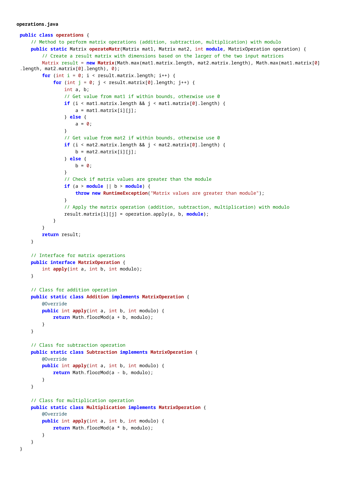

# Rapport de Laboratoire : Matrices

**Durée du laboratoire :** 4 périodes  
**Auteurs :** Surbeck Léon, Nicolet Victor 
## Schéma UML

## Description des Classes

### Classe `Matrix`

La classe `Matrix` représente une matrice de taille \(N x M\) avec un ensemble d'éléments compris entre \(0\) et \(n-1\), où \(n\) est défini comme le modulo de la matrice.

#### Attributs

- `int[][] matrix`: Tableau 2D pour stocker les valeurs de la matrice.
- `int N, M`: Dimensions de la matrice (nombre de lignes et colonnes).
- `int n`: Modulo des éléments.

#### Méthodes

- **Constructeur `Matrix(int N, int M, int n)`** : initialise une matrice de dimensions \(N x M\) avec des valeurs aléatoires modulo \(n\).
- **`fillMatrix(int n)`** : remplit la matrice avec des valeurs aléatoires comprises entre \(0\) et \(n-1\).
- **`printMatrix()`** : affiche le contenu de la matrice.

### Classe `operations`

La classe `operations` permet de réaliser les opérations entre deux matrices en respectant le modulo \(n\).

#### Méthodes

- **`operateMatr(Matrix mat1, Matrix mat2, int module, MatrixOperation operation)`** : effectue une opération donnée (addition, soustraction ou multiplication) sur deux matrices en appliquant le modulo et retourne le résultat.
- **`MatrixOperation` (Interface)** : Interface pour définir une opération entre deux matrices, implémentée pour chaque type d'opération spécifique.

#### Sous-classes d'`operations.MatrixOperation`

1. **`Addition`** : Addition élément par élément des deux matrices avec un résultat modulo \(n\).
2. **`Subtraction`** : Soustraction élément par élément des deux matrices avec un résultat modulo \(n\).
3. **`Multiplication`** : Multiplication élément par élément des deux matrices avec un résultat modulo \(n\).

### Classe `Main`

La classe `Main` permet de tester le programme en créant deux matrices de tailles spécifiées et en appliquant les opérations d'addition, soustraction et multiplication entre elles.

#### Exécution du Programme

Le programme est exécuté en ligne de commande avec les arguments suivants :

- **Argument 1 :** Modulo \(n\) des matrices
- **Argument 2, 3 :** Dimensions \(N1 x M1\) de la première matrice
- **Argument 4, 5 :** Dimensions \(N2 x M2\) de la deuxième matrice

Si les arguments ne sont pas fournis, des valeurs par défaut sont utilisées.

## Tests

### Description

Ce rapport documente les différents tests de cas limites effectués pour la classe `Main`, qui exécute des opérations de base (addition, soustraction et multiplication) sur deux matrices en utilisant une arithmétique modulaire.

## Cas de Test

#### Cas 1 : Matrices avec des valeurs par défaut

**Description** 
Ce test utilise des valeurs par défaut pour les matrices et le module, ce qui est supposé fonctionner normalement sans aucune erreur.

**Entrée**
\- Module : `10`
\- Matrice 1 : `5x5`
\- Matrice 2 : `5x5`

**Résultats Attendus** 
Toutes les opérations devraient s'effectuer correctement sans générer d'exception. La sortie devrait inclure les matrices générées aléatoirement, ainsi que leurs résultats après chaque opération d'addition, de soustraction, et de multiplication.

#### Cas 2 : Dimensions non compatibles pour la multiplication

**Description** 
Ce test crée deux matrices avec des dimensions incompatibles pour la multiplication. Ce cas permet de vérifier si le programme gère correctement cette erreur.

**Entrée**
\- Module : `10`
\- Matrice 1 : `3x5`
\- Matrice 2 : `4x5`

**Résultats Attendus** 
Une exception ou un message d'erreur est attendu lors de l'opération de multiplication, car les dimensions de Matrice 1 et Matrice 2 ne sont pas compatibles. Les opérations d'addition et de soustraction devraient néanmoins être exécutées normalement si les dimensions de lignes et de colonnes correspondent.

#### Cas 3 : Module avec des valeurs limites (`0` et `1`)

##### Sous-cas 3.1 : Module égal à `0`

**Description** 
Un test avec `module = 0` est utilisé pour évaluer le comportement du programme avec une valeur de modulo potentiellement invalide, qui pourrait entraîner des divisions par zéro ou d'autres erreurs.

**Entrée**
\- Module : `0`
\- Matrice 1 : `5x5`
\- Matrice 2 : `5x5`

**Résultats Attendus** 
Le programme devrait idéalement gérer ce cas en produisant une erreur ou en rejetant la valeur `0` pour le module, car le modulo `0` n'est pas défini dans les mathématiques classiques.

##### Sous-cas 3.2 : Module égal à `1`

**Description** 
Ce test utilise un module de `1`, ce qui signifie que toutes les valeurs de matrice devraient théoriquement être réduites à `0` dans les opérations mod.

**Entrée**
\- Module : `1`
\- Matrice 1 : `5x5`
\- Matrice 2 : `5x5`

**Résultats Attendus** 
Toutes les valeurs dans les résultats d'addition, de soustraction, et de multiplication devraient être `0`, car toute opération mod `1` donne `0`.

#### Cas 4 : Dimensions de matrices incorrectes

##### Sous-cas 4.1 : Matrice avec 0 ligne

**Description** 
Le test utilise une matrice avec `0` ligne, ce qui représente une matrice vide. Ce cas vérifie si le programme gère les matrices sans ligne de manière appropriée.

**Entrée**
\- Module : `10`
\- Matrice 1 : `0x5`
\- Matrice 2 : `5x5`

**Résultats Attendus** 
Une erreur ou un avertissement est attendu pour signaler qu'une matrice vide ne peut pas participer aux opérations matricielles.

##### Sous-cas 4.2 : Matrice avec 0 colonne

**Description** 
Similaire au cas précédent, mais cette fois avec `0` colonne, pour tester la gestion des matrices sans colonne.

**Entrée**
\- Module : `10`
\- Matrice 1 : `5x0`
\- Matrice 2 : `5x5`

**Résultats Attendus** 
Une erreur ou un avertissement est attendu pour indiquer qu'une matrice sans colonne ne peut pas être manipulée dans les opérations de matrices.

##### Sous-cas 4.3 : Dimensions négatives

**Description** 
Ce test utilise des valeurs de dimension négatives, ce qui est un cas invalide et permet de vérifier que le programme gère bien les valeurs de dimension non-positives.

**Entrée**
\- Module : `10`
\- Matrice 1 : `-3x5`
\- Matrice 2 : `5x5`

**Résultats Attendus** 
Une exception ou un message d'erreur indiquant que les dimensions de matrice ne peuvent pas être négatives est attendu.

**Résultats Obtenus**
Les résultats obtenus sont conformes aux attentes. Le programme génère une exception pour les cas de dimensions incompatibles pour la multiplication, les modules nuls ou négatifs, et les matrices vides.

### Code source 

#### Matrix.java

#### operations.java

#### Main.java

### Hypothèses de travail 

- Les dimensions des matrices sont des entiers positifs.
- Les valeurs des éléments des matrices sont des entiers positifs.
- Les valeurs des éléments des matrices sont comprises entre \(0\) et \(n-1\).
- Les valeurs des éléments des matrices sont générées aléatoirement.
- Les opérations sont effectuées en respectant le modulo \(n\).
- Les matrices sont affichées en ligne avec les éléments séparés par des espaces.